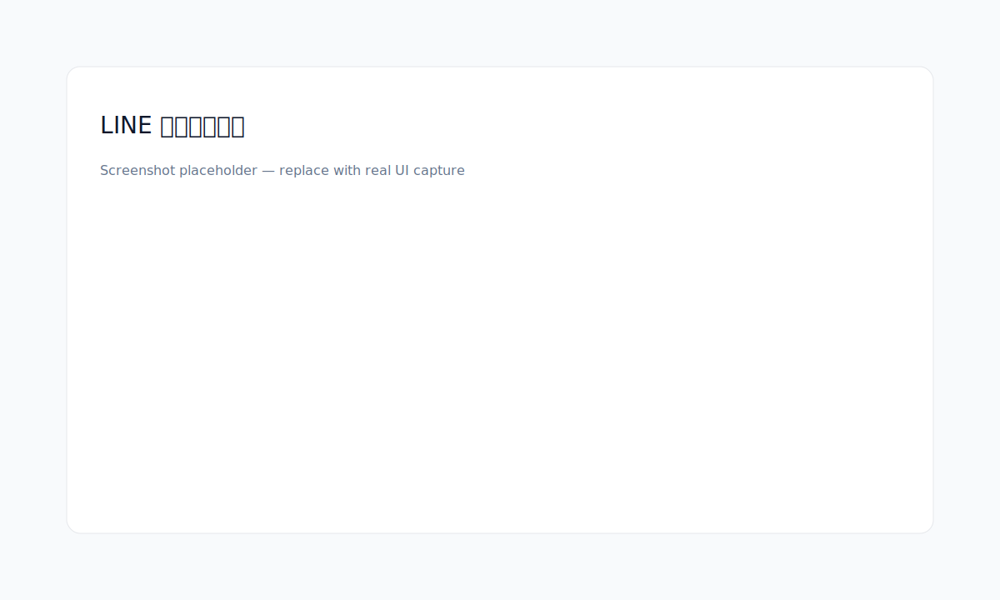

# LINE Sticker Platform


This project is the official **LINE Sticker Platform**, providing an end‑to‑end flow from **theme → drafts → images → background removal → export**. It supports **BYOK (Bring Your Own Key)** and allows **per‑task provider/model selection**.

## Features
- Full‑stack Go + Vue
- BYOK (API keys are kept in memory only)
- Per‑task provider/model selection for text/image/bg
- Real background removal (Replicate supported)
- ZIP export (includes main.png / tab.png / metadata / report)
- i18n (zh‑TW / zh‑CN / EN / JA / KO)

## Local Development
**Backend**
```bash
cd backend
go run ./cmd/app
```

**Frontend**
```bash
cd frontend
npm install
npm run dev
```

## Quick Test
1. Open `http://localhost:5173`
2. Enter your BYOK key
3. Follow the flow → generate → remove background → export

## Deployment (short)
**Backend**
```bash
cd backend
GOOS=linux GOARCH=amd64 go build -o app ./cmd/app
./app
```

**Frontend**
```bash
cd frontend
npm install
npm run build
# Deploy dist/ to any static host (Vercel / Netlify / Cloudflare Pages)
```

## Screenshots


## Changelog
- `v0.1.x`: MVP (drafts / generate / remove BG / export)
